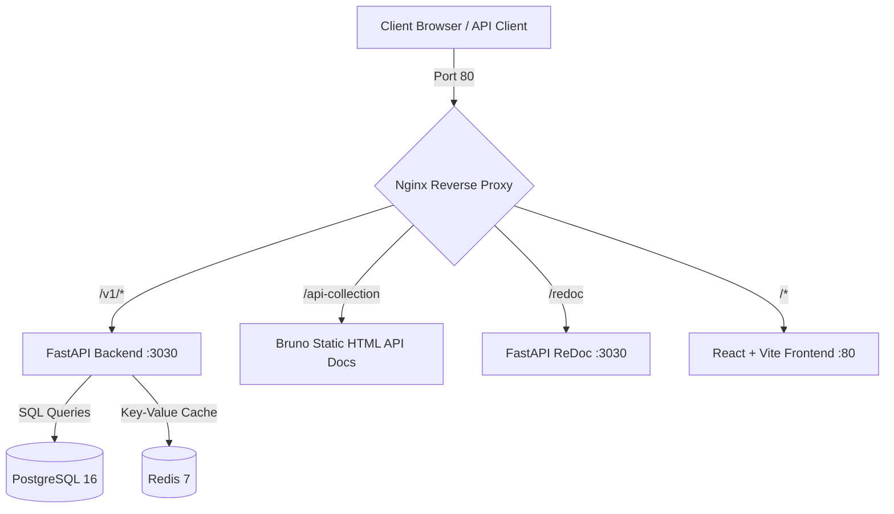

# Team Task Tracker API

Find the live demo at https://nxt-wave-sde-2-assignment.siddharthramnani.me

A production-grade, highly scalable, and fully containerized REST API with a companion interactive React frontend, built for team-based task tracking. Featuring JWT-based authentication (with secure refresh token rotation), a strict middleware-enforced **Role-Based Access Control (RBAC)** model, high-performance database indexing, and real-time **Redis caching with an event-driven tenant-isolated invalidation strategy**.

Designed as a modern, premium cloud-native application, this system is fronted by an Nginx reverse proxy that coordinates all client interactions, serves beautiful dynamic API collections, and hosts interactive ReDoc documentation.

---

## System Architecture

Below is the visual high-level architecture showing the components orchestrated by Docker Compose:



---

## Quick Start (One-Command Setup)

The environment has been carefully pre-packaged using Docker Compose. You do not need to install local dependencies or configure databases manually.

### 1. Start the Stack
Run the following command in the project root directory:

```bash
docker compose up --build
```

This single command will pull the required images, build the custom backend/frontend containers, execute the database schema migrations, and spin up the complete stack.

### 2. Access the Application
Once the containers are running, you can access the different layers of the platform at:
*   **Interactive React Web Application:** [http://localhost](http://localhost) (Served on standard Port 80)
*   **Interactive API Documentation (ReDoc):** [http://localhost/redoc](http://localhost/redoc) (Direct) or [http://localhost/v1/redoc](http://localhost/v1/redoc) (via Proxy Prefix)
*   **OpenAPI Specification JSON:** [http://localhost/openapi.json](http://localhost/openapi.json) (Direct) or [http://localhost/v1/openapi.json](http://localhost/v1/openapi.json) (via Proxy Prefix)
*   **Static API Collection Documentation:** [http://localhost/api-collection](http://localhost/api-collection) (Bruno HTML collection)
*   **FastAPI REST API Base URL:** [http://localhost/v1](http://localhost/v1)

---

## Authentication & Authorization (RBAC)

The backend implements a highly secure authentication flow with **JWT Access Tokens** (short-lived) and **Refresh Tokens** (long-lived, with single-use rotation to prevent replay attacks).

### Middleware-Enforced RBAC
Permissions are decoupled entirely from API controllers and business logic. They are handled at the middleware layer using FastAPI's dependency injection system, verifying authorization before any request reaches the handler.

| Role | Organization Scope | Permitted Actions |
| :--- | :--- | :--- |
| **`ADMIN`** | Tenant | Full administrative access: Manage users, projects, organizations, and all tasks. |
| **`MANAGER`** | Tenant | Project and task management (Create, Read, Update, Delete), assign members. Cannot manage users. |
| **`MEMBER`** | Tenant | **View & Update Status ONLY** for tasks explicitly assigned to them. Forbidden from editing task metadata (title, due date, priority, assignee) or seeing other users' tasks. |

*Note: Access control checks verify that a user can never see or modify data belonging to another Organization (Tenant Isolation).*

---

## Database Design Decisions & Indexing

The platform is backed by **PostgreSQL 16**. The schema is optimized for multi-tenant SaaS deployment, keeping user information and tasks strictly isolated under organizations.

### The Schema Layout
*   **`organizations`**: Master tenant table.
*   **`users`**: User records containing bcrypt password hashes, role enums, and organization relations.
*   **`refresh_tokens`**: Keeps track of active, rotated, or revoked user sessions.
*   **`tasks`**: Task tracking details containing UUIDs, status, priorities, assignee relations, and deadlines.

### Production-Grade Database Indexing
To support rapid performance under high write and read loads, several specialized indexes were added to the `tasks` table:

1.  **`idx_tasks_organization_id` on `tasks(organization_id)`**:
    *   *Rationale*: This is the most crucial index for SaaS tenant isolation. Since every query is filtered by `organization_id` (enforced via active session context), this index restricts database lookups to the tenant's partition immediately, preventing full table scans across other organizations.
2.  **`idx_tasks_assignee_id` on `tasks(assignee_id)`**:
    *   *Rationale*: Heavily used for retrieving the dashboard listing for the active user. In particular, `MEMBER` users query only tasks assigned to them. This index ensures assignee queries are highly efficient.
3.  **`idx_tasks_status` on `tasks(status)` & `idx_tasks_due_date` on `tasks(due_date)`**:
    *   *Rationale*: Essential for kanban-style filtering, priority task listings, and cron-like background jobs tracking overdue tasks.

---

## Redis Caching & Invalidation Strategy

To minimize database roundtrips and accelerate page loads, task queries are cached using **Redis 7**.

### Caching Strategy
When a user requests a paginated, filtered list of tasks, the system computes a deterministic cache key that includes all query constraints and tenant identity:

```
tasks:org:{org_id}:page:{page}:limit:{limit}:status:{status}:priority:{priority}:assignee:{assignee_id}
```

*   **Caching TTL**: Cache entries have a Default Time-To-Live (TTL) of **300 seconds (5 minutes)**. This ensures that even in rare failure scenarios, stale cache auto-heals quickly.
*   **Graceful Degradation**: If Redis goes offline or suffers a network timeout, the application logs the warning and gracefully falls back to querying the database directly, ensuring zero downtime for the user.

### Event-Driven Tenant-Isolated Invalidation
To prevent users from seeing outdated task info, we implement a real-time invalidation strategy:
1.  **Mutation Listener**: Any task modification (Create, Update, or Delete) triggers a cache invalidation task.
2.  **Tenant-Scoped Invalidation**: The invalidation engine scans for keys matching the tenant's pattern `tasks:org:{org_id}:*` using Redis `SCAN` iterator.
3.  **Purging**: All matching keys are immediately deleted.
4.  **Why this is optimal**: By scoping the key invalidation to `{org_id}`, we ensure that a task update in *Tenant A* never purges or affects the cache of *Tenant B*, keeping Redis operations highly scalable and memory-efficient.

---

## What I Would Improve / Add Given More Time

While the core platform is highly resilient, secure, and ready for deployment, the following enhancements would be made with additional time:

1.  **Strict State Transition Logic (Backend Enforced)**:
    *   *Current State*: Validated cleanly on the frontend.
    *   *Improvement*: Add a strict backend transition schema mapping inside the `tasks` update logic to strictly enforce state changes (e.g. throwing a `400 Validation Error` if a client attempts to jump directly from `TODO` to `DONE` without going through `IN_PROGRESS` and `IN_REVIEW`, while allowing transitions to `BLOCKED` from any active state).
2.  **Robust Integration & Performance Testing**:
    *   Create a complete end-to-end integration test suite using `pytest` and `pytest-asyncio`, testing JWT rotation, RBAC violations (e.g., a `MEMBER` attempting to update a task title), and concurrent cache invalidation performance.
3.  **Real-Time Collaborative Task Updates**:
    *   Utilize future WebSocket or Server-Sent Event (SSE) infrastructure to push immediate, event-driven state updates to other users when a task gets updated, allowing teams to collaborate in real-time without manual page refreshes.
4.  **Admin User-Provisioning Dashboard**:
    *   Build out standard User CRUD endpoints scoped to the `ADMIN` role, allowing real-time invitations, role upgrades/downgrades, and accounts activation/deactivation from the UI.
